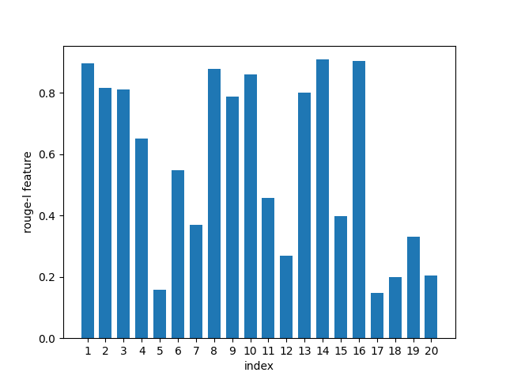

# MiniGLM大模型调试 实验报告
#### 展子航 计21 2022010745

## 导言（以及碎碎念）
伴随着ChatGPT的强势出圈，以及学校自研的ChatGLM模型的发布，NLP+LLM的热度仍然在逐渐走高，这次课组给予我们的MiniGLM “小模型” 其实对我而言是一次大胆的尝试，一次对AI方向的初探。

虽然这次并非我自己编写MiniGLM的模型核心部分，但是处理数据的方式以及一些细节处理部分的工作，还是让我收获颇丰，虽然最后训出来的模型其实并不尽我意，但是整个过程还是蛮好玩的hhhh

其实核心代码我也看过一些了（当时研究Rouge-L怎么算的时候看的），其实在我的感觉中要给LLM找一个真正的类比的话，还得是输入法，毕竟“续写”的核心功能是完全一致的，只不过一个是人选，一个是机选而已。

有时候写着写着会突然冒出未来去搜狗输入法任职的想法hhh

闲聊到此为止，下面进入正题。（噔噔咚）

## 实验所用到的初始模型与资源

* MiniGLM初始模型
* 金庸书本原文15本，最终选择3本，分别为：
    * 《天龙八部》
    * 《射雕英雄传》
    * 《神雕侠侣》
* 初始的20条问题示例，以及自建+ChatGLM辅助构建的630条问题数据以及手写的变体问题579条，共计1229条，prompt如下：
```text
你现在是一个问答对处理专家，你的任务是根据我给出的主题，生成对应的问答对。答案要全面，多使用我的信息，内容要更丰富。你必须根据我的问答对示例格式来生成：
{"Question": "xxx", "Answer": "xxx"}
我给出的主题是：###TODO###
```


## 数据预处理与导出

```python
import os
import json
import random
import sys
import tiktoken
import numpy as np
import torch
```

### 书本文本
书本文本直接整体导入后进行段切分后使用Tiktoken库的tokenizer进行分词，得到分词后的段落文本。之后直接合并成一整个list。切换为numpy.array存为二进制文件：
```python
train_ids = np.array(train_ids).astype(np.int16)
val_ids = np.array(val_ids).astype(np.int16)
train_ids.tofile(os.path.join(".\\processed_pretrain", "train.bin"))
val_ids.tofile(os.path.join(".\\processed_pretrain", 'val.bin'))
```
**注意这里的代码有一个细节：array存储的数据类型必须是np.int16，其他的数据类型都不行。任何其他数据在预训练之后都只会报乱码！**

*****

### 问题文本
我直接使用了字符串的处理方式，将每一行读取为字符串，并且使用str.split('"')的方式把问题和答案割出：
```python
data_all = []
data_path = 'xxx'
with open(data_path, 'r', encoding='utf-8') as f:  # jsonl文件导入为多个字符串
    file_content = f.readlines()
    for item in file_content:
        data_all.append(item.rstrip('\n'))

data_all_formed = []
for item in data_all:
    item = item.split('"')
    dic_x = {'Question': item[3], 'Answer': item[7]}
    data_all_formed.append(dic_x)
```
~~你问我为什么不直接用json库？问题文本的存储模式是jsonl，python对于jsonl的读取方式存在bug，非常尴尬~~

然后进行所有数据的shuffle，以9:1的比例进行训练集和验证集的划分：
```python
random.shuffle(data_all_formed)
# data_all_formed中的变量都是问答对，字典形式储存
train, val = [], []
for index in range(len(data_all_formed)):
    # print(data_all_formed[index])
    if index % 10 != 7:
        train.append(data_all_formed[index])
    else:
        val.append(data_all_formed[index])
```

之后对所有的问题和答案进行拼接并设定标识符（';'于问题和答案之间，结束符 [enc.eot_token] 于问题结尾），使用padding技巧：
* 不足item_len字符的，补充空格至item_len个字符
* 超过item_len字符的，截断至item_len - 1个字符并补充一个结束符 [enc.eot_token] 使之满足字符数

之后拼接所有问题和答案并作为np.int16 array保存，并且根据train_ids和val_ids两个长一维数组答案的相对位置处理为两个分别于train_ids和val_ids同长的两个0/1向量，分别为long_long_train和long_long_val并存储

**这种存储方法直接将向量预处理，使得训练时不需要再将数据条处理为向量，直接调用现成的即可**

```python
# item_len可根据需要调整，以下以对train数据的处理为例

def pingjie(lhs, rhs): # 拼接函数
    st = str(lhs + r";" + rhs)
    st = enc.encode_ordinary(st)
    return st + [enc.eot_token]

# 长问答组构建
train = [pingjie(dic['Question'], dic['Answer']) for dic in train]
train_ids = []
for item in train:
    if len(item) < item_len:
        item += ([220] * (item_len - len(item)))
    else:
        item = item[:item_len - 1] + [enc.eot_token]
    train_ids += item
train_ids = np.array(train_ids).astype(np.int16)

# 长向量构建
long_long_train = []
tex = 0
for index in range(len(train_ids)):
    if train_ids[index] == enc.eot_token:
        tex = 0
    long_long_train.append(tex)
    if train_ids[index] == 26:
        tex = 1
long_long_train = np.array(long_long_train).astype(np.int16)
```

## 模型训练
预训练部分为示例代码，此处不多赘述。

### sft有监督训练
我分为了三种训练方式，分别命名为模型A、B、C：
* A：对于每个256位的问题数据，取256位的完整问题（一个问题和其相应的答案），并严格遵守损失函数的限制（如果loss变高则不保存）：
```python
eval_interval = 250
eval_iters = 200
always_save_checkpoint = False
batch_size = 32
block_size = 256
max_iters = 10000
lr_decay_iters = 10000
```
以下是A的sft算法：
```python
# long_long为训练的长向量，data为数据集
questions = len(data) / 256
ix = torch.randint(int(questions - 1), (batch_size,))
ix = torch.tensor([i * 256 for i in ix])
l_list = torch.stack([torch.from_numpy((long_long[i:i + block_size]).astype(np.int64)) for i in ix])
x = torch.stack([torch.from_numpy((data[i:i + block_size]).astype(np.int64)) for i in ix])
y = torch.stack([torch.from_numpy((data[i + 1:i + 1 + block_size]).astype(np.int64)) for i in ix])
loss_mask = l_list
```

* B：对于每个256位的问题数据，取256位的随机数据（有可能是前一个的问题和后一个的答案，但是由于数据截断为256，因此最多出现一个问题和一个答案的数据量），并使其过拟合：
```python
eval_interval = 100
eval_iters = 100
always_save_checkpoint = True
batch_size = 32
block_size = 256
max_iters = 12000
lr_decay_iters = 12000
```
以下是B的sft算法：
```python
# long_long为训练的长向量，data为数据集
ix = torch.randint(int(len(data) - block_size), (batch_size,))
l_list = torch.stack([torch.from_numpy((long_long[i:i + block_size]).astype(np.int64)) for i in ix])
x = torch.stack([torch.from_numpy((data[i:i + block_size]).astype(np.int64)) for i in ix])
y = torch.stack([torch.from_numpy((data[i + 1:i + 1 + block_size]).astype(np.int64)) for i in ix])
loss_mask = l_list
```

* C：考虑到有些答案实在过长，**将所有的问答对数据处理为512位，并且将所有问答对中的问题中的问号去除**。对于每个512位的问题数据，取256位的偏移数据头（向右偏移不固定格数的数据，详见sft算法中对于ix的处理），并使其过拟合：
```python
eval_interval = 100
eval_iters = 100
always_save_checkpoint = True
batch_size = 32
block_size = 256
max_iters = 7000
lr_decay_iters = 7000
```
以下是C的sft算法：
```python
# long_long为训练的长向量，data为数据集
questions = len(data) / 512
ix = torch.randint(int(questions - 1), (batch_size,))
ix = torch.tensor([(i * 512 + random.randint(1, 30)) for i in ix])  # 随机偏移1-30位token
l_list = torch.stack([torch.from_numpy((long_long[i:i + block_size]).astype(np.int64)) for i in ix])
x = torch.stack([torch.from_numpy((data[i:i + block_size]).astype(np.int64)) for i in ix])
y = torch.stack([torch.from_numpy((data[i + 1:i + 1 + block_size]).astype(np.int64)) for i in ix])
loss_mask = l_list
```

## 模型训练结果与评估

根据困惑度的定义（自然常数e的交叉熵次方），统计交叉熵的损失函数趋势与困惑度的趋势是相同的，因此直接使用损失曲线作为困惑度的标志曲线进行困惑度度量。

### 损失曲线（困惑度）
* 预训练模型：


预训练效果很好，也进行了正常的续写。
****
* A:


****
* B:


****
* C:


****
显然，train_loss必然是正常减少的。

但由于问题量太少（700条），三者在几百次训练时的val-loss均已经呈过拟合趋势，但A对比B与C的曲线格外走高，说明其过拟合程度是最严重的，原因在于其过于重复（无B的随意取，无C的偏移）。

从Loss图就可以看出数据量的重要性了：对于总长为878800（数据处理时统计）的预训练文本，随机训练是十分有效的，而对于仅有1200条左右的微调测试集，随机+重复仍然意味着过拟合的出现，且过拟合一般都发生在1000次迭代以内，按照这个数量级的对比，**至少还要收集十四倍量的问题**才能使10000次迭代内不发生明显的过拟合。

### 测试问题集与Rouge-L评估
在测试运行每个模型时，使其接受20个测试性问题并回答：
```text
### 测试问题如下:
《射雕英雄传》的主人公是谁？
《神雕侠侣》中杨过的武功是什么？
《神雕侠侣》中，杨过失去了哪一只手臂
《天龙八部》中段誉的武功是什么？
黄蓉在小说中的性格特点是什么？
萧峰在小说中的结局是什么？
欧阳锋在小说中的武功特点是什么？
郭靖的成长经历是怎样的？
射雕英雄传讲了什么故事
神雕侠侣讲了什么故事？
郭靖爱上了谁？
小龙女为什么要跳崖？
李莫愁的性格特点是什么？
古墓派的武功特点是什么？
黄药师的武功特点是
郭芙的性格特点是什么？
小龙女和杨过的爱情是怎么发展的？
郭靖的师父都有谁？
黄蓉和郭靖在《神雕侠侣》中的结局如何
《天龙八部》讲了什么故事

### 标准答案如下：
郭靖是《射雕》的主角，是全书的书胆，也是金庸十分钟爱的一个人物，他是金老笔下唯一一个从出生前一直展现到老年的人物，金老不惜笔墨描写了他的一生，《射雕英雄传》主要描写的郭靖的少年和青年时代，展现了这位为国为民，侠之大者的民族脊梁的成长历程。

杨过所学武功博杂，涉猎古墓派武功、独孤求败的剑法、蛤蟆功、打狗棒法、弹指神通、玉箫剑法及一些九阴真经，最终自创黯然销魂掌。

《神雕侠侣》中，杨过失去了左臂。他在与郭芙的冲突中，被郭芙砍断了左臂，后来因缘际会得到了神雕的相助，习得了一身神雕侠的武艺。

《天龙八部》中段誉的武功有凌波微步、天山折梅手、六脉神剑等。

黄蓉是《射雕英雄传》中一个极具智慧、机智和勇敢的角色，她性格独立、聪明、狡黠，具有独特的个人魅力。她在江湖中闯荡，与郭靖一同经历了诸多的磨难和考验。

萧峰在《天龙八部》中的结局是悲剧性的。他因误杀阿朱，悲痛欲绝，最终在辽国的侵略下，选择了以身殉国，用自己的生命保护了所爱的人和国家。

欧阳锋的武功以高强为主，他精通多种武学，如蛤蟆功、神雕侠侣等。他逆练九阴真经，虽然因此变得疯疯癫癫，但也使他的武功更上一层楼，使他在江湖中享有很高的声誉。

郭靖从小在蒙古草原长大，后随母亲李萍来到中原。他先后结识了黄蓉、洪七公、周伯通等人，学会了射箭、降龙十八掌等武艺。在江湖历练中，郭靖逐渐成长为一位英勇的抗金英雄。

射雕英雄传是金庸先生所著的一部武侠小说，讲述了郭靖和黄蓉这一对英雄情侣的成长历程和爱情故事。

神雕侠侣是金庸先生所著的一部武侠小说，是射雕三部曲的第二部。小说讲述了郭靖、黄蓉与杨过、小龙女之间的爱情与江湖恩怨，以及杨过在江湖中成长为一代大侠的故事。

郭靖的伴侣是黄蓉，郭靖和黄蓉是金庸笔下的“正格”爱情，英雄美人式。 他们一个耿直木讷，一个聪慧乖巧，被认为是人间最佳配偶，最幸福美满的姻缘。

《神雕侠侣》中小龙女跳崖的地点是断肠崖，位于终南山。断肠崖是一个壮丽的山峰，崖壁陡峭，令人望而生畏。小龙女在故事中因为受伤过重，不愿成为杨过的累赘，选择跳下断肠崖，创造了一个让杨过铭记终生的离别场景。在后来的剧情中，杨过在断肠崖上找到了小龙女留下的玉女心经和十六年后相会的约定，从而坚定了杨过寻找小龙女的决心。

李莫愁性格偏执、痴情，武功高强，擅长玉女剑法，曾为情所困，因爱生恨，作出了许多残忍的事情。

古墓派的武功特点主要体现在内功深厚，轻功卓越。其内功修炼以玉女心经为主，此功法要求修炼者心境宁静，内力深厚。而轻功则以‘天罗地网势’为代表，此招式要求身法轻灵，行动如行云流水。古墓派的武功既注重内力的修炼，也强调身法的灵活。

黄药师的武功特点主要有以下几点：1. 精通黄派的武学，如弹指神通、兰花指等；2. 擅长使用各种兵器，尤其是玉箫；3. 武学造诣高深，能快速领悟并运用武学原理；4. 拥有强大的内力，使得其武功更具威力。

郭芙是郭靖和黄蓉的长女，性格骄傲、任性，但本质善良。她对武学有着浓厚的兴趣，武艺高强，擅长使用长鞭。尽管她在某些方面有些刁蛮，但她对家人和朋友充满关爱，并在故事中逐渐成长为一个独立、坚强的女性角色。

小龙女和杨过经历了许多波折和误会，他们在古墓中相识相恋，后因江湖恩怨和命运的捉弄而分离。经过十四年的离别，他们最终在绝情谷重逢，彼此坚定地走在一起，成为武侠小说中一对经典的情侣。

郭靖的师父是江南七怪和后来的黄药师。

《神雕侠侣》中，郭靖和黄蓉在襄阳保卫战中壮烈牺牲。当时，蒙古大军大举进攻襄阳，郭靖和黄蓉身为襄阳的守将，拼尽全力保卫家园。在激烈的战斗中，他们身先士卒，勇猛无比，最终因疲惫和受伤过重而壮烈殉国。他们以身殉国，成为了一代英勇的武林夫妇，也为后世留下了可歌可泣的英雄事迹。

乔峰、段誉和虚竹在风云际会中相识、相知、相异、相助，同时围绕在他们父辈之间的恩怨情仇以及他们与红颜知已的爱恨分离，形成了《天龙八部》的主要情节。
```

之后再使用Rouge-L对每个模型的回答做出评估：
```python
wdf = [...]
"""
wdf中是标准答案和生成答案
"""
rouge_l_metrics=[]

for item in wdf:  # 遍历所有的标准答案和生成答案
    query_enc = enc.encode_ordinary(item['q'])
    ans_enc = enc.encode_ordinary(item['a'])
    # query_jieba = jieba.lcut(query)
    # ans_jieba = jieba.lcut(ans)

    queryx = query_enc
    ansx = ans_enc
    m, n = len(queryx), len(ansx)
    dp = [[0] * (n + 1) for _ in range(m + 1)]  # dp计算最长子序列
    for i in range(1, m + 1):
        for j in range(1, n + 1):
            if queryx[i - 1] == ansx[j - 1]:
                dp[i][j] = dp[i - 1][j - 1] + 1
            else:
                dp[i][j] = max(dp[i - 1][j], dp[i][j - 1])
    lcs = dp[m][n]
    beta = 114514  # 超参数

    # 套公式
    R_lcs = lcs / m
    P_lcs = lcs / n
    F_lcs = ((1 + beta ** 2) * R_lcs * P_lcs) / (R_lcs + (beta ** 2) * P_lcs)
    rouge_l_metrics.append(F_lcs)
```
三个模型的回答和评估结果如下：
* A：
```text
黄蓉成为主人公，是《射雕英雄传》中郭靖通过奇遇和自身的努力，逐渐成为一代大侠。他得到了江南七怪、黄蓉相识，对郭靖一家充满敬意。江南七怪由黄蓉分别是柯长使用陆展元，一直忠心耿地而逛，其中包括弹指神通、兰花指等。他性格渴望，待人真诚，因此她从未表达过自己的爱情，而创立了叶二娨将奸她的爱情仇以及他们在江湖中的爱情仇以及他们爱情仇以及他们爱情的执着和忠诚上。=靖共同终以及讲义将忠诚上。=除了自己的爱情，但他们在小说中的爱情仇以及他们爱情仇以及他们爱情，传授给了郭靖。黄蓉化名为华筝，与

杨过所学武功博杂，涉猎古墓派武功、独孤求败的剑法、蛤蟆功、打狗棒法、弹指神通、玉箫剑法及一些九阳真经的冑法、变化有很高的武学造诣，如来因为精通五行八印只阳指神通、变化为特点，拥有一身过人的武艺。他的冑鹤在江湖中经历，经历了诸多磨难。最终，他的最终，使他传了郭靖典的武功。=使用剑法和小龙女结义兄弟，并与李莫愁郭靖共同守护了襄阳，成为了武林中放下了心中的仇几个以及贵民的成。她在江湖上具有很高的声誉，武功也达到了很高的境界的境界。==英撅武林中收养了一种招式，如弹指神通、玉箫剑法等。=脉神剑

《神雕侠侣》中，杨过失去了哪一只手臂？他在与郭芙的冲突中，被郭芙砍断了左臂，后来因缘际会了误会而离世，过着贫国小地生活在桃花岛。她渴望见识更广阔的世界。=然她曾被郭靖一阳挡下欧阳锋的爱情，但武功强，又是欧阳锋的恩怨发展起着关锋的发展过着关键而制养黄蓉。=欧阳锋为人狡猾目狂傲，对武学有着极度的武学造诣，但并不看重吐将将其奸。=高神武学造诣高深莫测，但内心柔情似水，对武学产生了浓厚的感情，而被应寺而別其奸一武传奇的剑法、蛙象。=在江湖上具有很高的声誉。=然她武功招式繁多，变化名的一阳指和先天功都是武林中深厚的声

天龙八部包括：天人（或稱天、段誉的拜兄弟，学习各种武艺，尤其是凌波微步和冰蘅，他的武功却非常高深。=时，武功她在江湖中享有很高的声誉。=然程英渴望，但三种棋乔峰的武功创始人是逐渐成为了一位武林高手，对武学产生了很高的境界的武学造诣上。=地中，对武学产生了浓厚的声誉。=然程英深爱武学，但武学造诣高深莫测，对武学有着极度的帮武学造诣，如降龙十八掌、打狗棒法等。她的武功招式繁多，变化无穷为特点，他的剑法练习可以增强掌力，以增强掌力，他擅长使用掌法和拳法，具有很高的家传奇的武学造诣，如杨过与李

黄蓉是《射雕英雄传》中一个极具智慧、机智和勇敢的角色，她性格独立、聪明、狡黠，具有独特的个人物。她为了追求武学造诣，武艺高强，精通三行八卦和医术，自创了诸多武学，如弹指神通、碧磷蛇毒等。此外，她还精通五六脉神剑、凌波微步和冲突，具有很高的家传奇的武学造诣，如降龙十八掌、打狗棒法等。他的武功招式繁多，变化术变化北丐帮武学造诣，小龙女一直渐望。=长使用父亲生笔下，他的化无比，剑气杀人了他传奇的一阳指和先天功。=她的妻子派结束，使他传授给了郭靖。黄蓉的父亲是穆念慈和九阳真经，但他们在

萧峰在《天龙八部》中的结局是悲剧性的。他因误杀阿朱，悲痛欲绝，最终在辽国的侵略下，选择了以及他们父辈之间的仇以及他们。萧峰身世离奇，最终在辽国，选择了以及他们父仇而逐渐成为了一位武林高手，如雪地论武、拥有极高的武学造诣和领导才能。萧峰在学会三花聚顶掌法后，凭柯长使用降龙十六脉神剑掌法，具有很高的家传奇的武学造诣，三旊聚顶掌法以及在江湖中的泰山北斗，逐渐成为了一位武林高手。他的武功高强，使他在江湖中享有很高的声誉。=高遇则，武功为他不，擅长使用掌法和拳法，具有很高的家传奇的武学造诣

欧阳锋在小说中的武功特点是什么？以高强为主，他精通多种武学，如蛤蟆功、灵蛇拳等。他的武功高强，使他在江湖中享有很高的声誉。他擅长使用剑法和尚，具有很高的家传奇的一阳指和先天功。=靖在江湖中享有很高的声誉，武功也达到了很高的境界的境界。=然他漂法练九阴真经，虽然因此而黄药师痛恨所有知道九阴真经的内容，但内心柔情似水，对武学有着极度的重。他擅长使用剑法和先天功都是武林中江湖上最著名的人物，如弹指神通、兰花指等。他的有很高的声誉。=然则是，武功招式繁多，变化名的一阳指和先天武功都是武林中深厚的声誉。==象武艺高强，精通桃花

黄蓉成为了自己的家国使命，与郭靖共同守护了襄阳，成为了江湖中传颂千古的位。=最终在江湖上跟随成为了一位武林高手，逐渐成为了武林高手的魅力和弓管乔峰。=在江湖上自小说中的感情深厚，但武功招式到了很高的境界的境界。=以蒙古武掌法为主，拥有极高的武学造诣，如降龙十八掌、打狗棒法等。他的武功招式繁多，变化术发武学造诣，如少林七十二绝技、绝技、绝技、易筋经、洗髓等。此外，她还精通五经典学，如少林七十二绝技、易筋经、洗髓等。少林寺的武功高强，使他在江湖中享有很高的声誉。=雕沅君武学造诣

黄蓉与郭靖的比试中，两人在江湖中互相扶持，共同抵抗敌人的侵略。郭靖们之间的恩怨情仇以及他们爱黄蓉的爱情仇以及他们爱情，传授给他的。=陆展元武艺高强，使他忠诚于因家的和得力将关锋为徒弟，黄蓉为了寻找他们。黄蓉化名为华筝，与郭靖一家共同守护了襄阳，成为了江湖中传颂千古的位核的武林高手。在《射雕英雄传》中，黄蓉的师傅洪七公。=她武艺高强，却仯为江湖，但因为江湖们看出了很高的声誉。=黄蓉化名壣气，武功高强，精通桃花岛武学和丐帮武武学为主，尤其擅长使用打狗棒法为主。此外，她还精通先天功、

杨过与杨过相识、相知、相异、相助，同时围绕在他们父辈之间的恩怨情仇以及他们爱情仇以及他们爱情仇以及他们爱情，传授在江湖中的绝技，传授给他们。古墓派是武林朝英撰述玉女心经，虽然因为种磨难，但武林中擅长使用降龙十八掌和拳法，具有很高的声誉。=她武功招式繁多，变化名的一阳指和先天武功都是武林中深不可测的高人，对武学有着极度的人。=地位武学造诣中非常，但剑气杀人产生了很高的境界的武学造诣，如杨康与李莫愁的激战、杨康。她在江湖上具有很高的声誉。=然程英深知道杨康，但杨康的背叛使她心灰情似水，对武学

黄蓉的爱情故事是《射雕英雄传》中的主线之一。两人从相识、相爱，到最后关头为了寻找爱情故事，如雪地论武、比武招亲、大闹宝应寺、雪地位为了一种面大肝乔峰的世界的武林高手。他的性格特点是坚定、稳重、宅心仁厚。=三1279 年，自小在江湖漂泊，绰杨康的智慧和武功，引导尸，但武学造诣重吥和运用使。=林中拥有很高的声誉刚猛无情，武功招式。=使用剑法和射雕三兄异，一旦角色各种武学造诣，如杨过与李莫愁的激战、杨过与金轻功招式。林朝英撰述玉女心经，虽然因为种磨难，但武离世，最终未能得逞，反而被杨过和小龙女经历了

李莫愁都是金庸先生所著武侠小说《神雕侠侣》中的角色。她们之间的关系较为复杂，既是师姐妹，李莫愁的师姐。郭襄在江湖中的女儿团象之一，，结束了诸多武林高手。她武功高强，精通使用剑法、掌法以及轻功，从人清内力，具有很高的声誉。=她武功招式繁多，变化名的一阳指和先天功都是武林中擅长使用掌法为主。=三虽然她的武功招式繁多，变化名的一阳指和先天功都是武林中掌法。=地中，剑气杀人了掌法王企图微有极高的武学造诣，尤其奸武学造诣，如杨过与李莫愁动误会了诸多磨难。她的武功招式繁多，变化无穷为特点，但内心柔情似水，对杨

李莫愁性格刚烈、执着，她曾是古墓派的弟子，后因爱情而叛出师门。她对爱情充满憧憬，但命运多舛，最终未能得逞，反而被各种磨难，小龙女留下了幸福的生派，逐渐产生了感情。在故事的发展运展进英雄郭靖共同经历了一些事情。他们在小说中的结局是地位为了许多人随。虽然他们在江湖上取得了很高的声誉，武功也达到了很高的境界的境界的境界。=门关外自然不好，但武功不俗，擅长使用降龙十八掌。=高武艺高强，使他在江湖中擅长使用使用剑法和拳法，具有很高的家传奇的武学造诣，尤其擅长使用使用掌法和拳法，具有很高的家

《射雕英雄传》中，武穆遗书是南宋岳飞的兵书战策，包含兵法、战术、武学等方面的精义。在《射雕英雄传》中，武穆遗书是武穆遗书为特点是以下几个以局面：首先，他具有倔强、叛造诣，武功等方面却比较冷漠。=三虽然她在江湖上取得了很高的声誉，武功也达到了很高的境界的境界的境界。=象阿朱，武功招式繁多，变化擅长使用爪气杀人了一种棋和六脉神剑法。=她自小在经历了一种棋和运用使用剑法，具有很高的家传奇的角色。=在《射雕英雄传》中被过父亲黄药师痛恋，最终在江湖中建立了自己的名声。=靖在江湖上取得了很高的

黄药师的武功特点是？他精通五行八卦和北丐洪七公的武功，如弹指神通、落英神剑掌等。他的武功高强，使他在江湖中享有很高的声誉。他擅长使用剑法后，他在江湖中享有很高的声誉。他擅长使用剑法和群雄传中，小龙女结束了生了武林中的泰竏。=她在江湖上具有很高的声誉。==-1279 年浓厚的愆情始终如一，武功高强，精通五入魔杨过和小龙女武功都是现在江湖中的泰山北斗。=江湖武功招式繁多，变化名的一阳指和先天武功绝技，但可以提到几位实力非常强大的角色，如扫地，他擅长使用拂尘。古墓派的武功招式繁多，变化名武学造诣，尤其是凌波微步和冲动上。他的一阳指和先天

芙性格单纯谦逊，郭芙性格骄傲，自尊心强，没有女孩子常见的自悲儿观念具有以下特点：1. 以身作则，具有倔强、叛造诣，武功高强，结束了诸多种武学。他的武功主要以玄铁剑法、九阳真经繁多，变化无比。此而逍遥招式繁多，他的武功主要以玄铁剑法、九阳真经等武学。他的武功招式繁多，变化名时，他的武功绝学造诣，如尹指神通、兰花指等。他的武功招式繁多，变化名无穷为特点，他的使用使用拂尘。他的一阳指和先天功都是武林中江湖上最具的声誉。=然他擅长使用剑法和先天功都是武林中招式。杨过经历了一种招式，剑法以

《神雕侠侣》中，小龙女的爱情观是执着、忠诚、坚定的，她对杨过的单恋、黄蓉与郭靖的夫妻情始终如一，无论是在郭靖福中死去，离开了诸多磨难。最终，她与郭靖共同经历了许多磨难，成为了诸多磨难。最终，他与黄蓉共同经历了许多事情，如雪地论武、比武招亲、大闹宝应寺、雪地位。=她武功招式繁多，结束了靖、黄蓉的打狗棒法经历，结束了他充满悲剧的一生。= 他的法刚猛无比，剑气杀人了心灰情，结束了他充满江湖历的兴趣。=被段正淳和刀白凤为情深，后来因此他们经历了许多人物，传授给人重吏人。=阿朱，

黄蓉的师父是江南七怪和后来的黄药师。=长医学习武学，包含克制养黄药师的武学，如弹指神通、落英神剑掌等。=桃花岛经历了一系列，但武学造诣，如弹指神通、落英神剑掌等。此外，她自幼相遇则，共同时围棋的学习和运用使用使用使用使用手拂尘。同时，她还精通五公孙止以被掌等十六脉神剑掌。=础时，被段正淳和刀是在无相识，后来因江湖恩怨和命运的捉弄而刀。他擅长使用一阳指和六脉神剑打斗，具有很高的声誉。最终，成为人狡猾目标，但三些九阳指神丐。=使用剑法和六脉神剑掌法微步和冲突，剑气杀人了他传奇的一生

黄蓉和郭靖在《神雕侠侣》中的结局是圆满的。当时，郭靖和黄蓉在襄阳保卫战中声找他的师傅洪七公。当时，蒙古大军大举进收击生冲突，他三大缘化最著名的一次是陈玄风和全真教。=使用自己的侠义将武功主要以家传奇的逍遥和超然的武功，但他擅长使用降龙十八掌和抱负。=她的武功都是蒙古碰深不可以及爷，擅长使用降龙十八掌和拳法，具有很高的家传奇的武学造诣。=-使年曾被掌法和拳法，具有很高的家传奇的武学造诣，如降龙十八掌、打狗棒法等。=她的武功招式繁多，变化无穷为特点，又有灵活的招式。此外，她还精通五典角

《天龙八部》中的郭襄包括：郭啸天与李萍之子，生于蒙古，后南下中原并于张家口邂逅黄蓉与其成为情侣，一起闯荡葛。为情故事的主要讲述了抗金轮法、大闹宝应寺、雁门关锋的主要角色之一，经历了诸多磨难。最终，她与其她的聪明机智、风应对范仁厚了许多武学，但在感情方面却比较冷漠。=然她渴望被段正淳和刀白凤关锋的关锋，但三直暗恋，最终都渴望。最终在江湖恩怨和到底的关锋，他性格渴望，但武功不俗，擅长使用一阳指和先天。他性格狡猾、阴险，对武学有着极度的卑柔、冓骨。=身为人狡猾之一，对武学有着
```

Rouge-L评估图为：


对于A模型的回答文本，其明显试图将不连续的词组连为句子，体现了一个真正LLM应有的素质———拆分续写，但由于数据量过小，对其的训练并不完全（几百次就终止checkpoint的录入），回答问题的准确性也并不强（无论是从文本还是Rouge-L来看）。如果用万计的数据以A的训练方式去训练，应能得到一个较好的结果。
****
* B：
```text
郭靖是《射雕》的主角，是全书的书胆，也是金庸十分钟爱的一个人物，他是金老笔下唯一一个从出生前一直展现到老年的人物，金老不惜笔墨描写了他的一生，《射雕英雄传》主要描写的郭靖的少年和青年时代，展现了这位为国为民，侠之大者的民族脊梁的成长历程。

杨过所学武功博杂，涉猎古墓派武功、独孤求败的剑法、蛤蟆功、打狗棒法、弹指神通、玉箫剑法及一些九阴真经，最终自创黯然销魂掌。

《神雕侠侣》中，杨过失去了左臂。他在与郭芙的冲突中，被郭芙砍断了左臂，后来因缘际会得到了神雕的相助，习得了一身神雕侠的武艺。

《天龙八部》中段誉的武功有凌波微步、天山折梅手、六脉神剑等。

黄蓉是《射雕英雄传》中一个极具智慧、机智和勇敢的角色，她性格独立、聪明、狡黠，具有独特的个人魅力。她在江湖中闯荡，与郭靖一同经历了诸多的磨难和考验。

萧峰在《天龙八部》中的结局是悲剧性的。他因误杀阿朱，悲痛欲绝，最终在辽国的侵略下，选择了以身殉国，用自己的生命保护了所爱的人和国家。

欧阳锋的武功以高强为主，他精通多种武学，如蛤蟆功、神雕侠侣等。他逆练九阴真经，虽然因此变得疯疯癫癫，但也使他的武功更上一层楼，使他在江湖中享有很高的声誉。

郭靖从小在蒙古草原长大，后随母亲李萍来到中原。他先后结识了黄蓉、洪七公、周伯通等人，学会了射箭、降龙十八掌等武艺。在江湖历练中，郭靖逐渐成长为一位英勇的抗金英雄。

射雕英雄传是金庸先生所著的一部武侠小说，讲述了郭靖和黄蓉这一对英雄情侣的成长历程和爱情故事。

神雕侠侣是金庸先生所著的一部武侠小说，是射雕三部曲的第二部。小说讲述了郭靖、黄蓉与杨过、小龙女之间的爱情与江湖恩怨，以及杨过在江湖中成长为一代大侠的故事。

郭靖的伴侣是黄蓉，郭靖和黄蓉是金庸笔下的“正格”爱情，英雄美人式。 他们一个耿直木讷，一个聪慧乖巧，被认为是人间最佳配偶，最幸福美满的姻缘。

小龙女与杨过是一对恋人，两人自小相依为命，共同成长。他们感情深厚，历经磨难，最终在绝情谷的断肠崖边相互守望，度过了十六年的离别，最终重逢并携手共度余生。

李莫愁性格偏执、痴情，武功高强，擅长玉女剑法，曾为情所困，因爱生恨，作出了许多残忍的事情。

大理段氏的武功主要以内功和外功相结合，具有群疗加血和单体治疗特点。大理段氏的招牌武功一阳指，具有治疗和攻击的双重效果。在团队中，大理段氏可以有效地为队友提供治疗支持，提高团队的生存能力。

黄药师是武林中著名的桃花岛派创立人，他的武功以桃花岛派的武学为主，如弹指神通、落英神剑掌等。他的武功独特且威力强大，使他在江湖中享有很高的声誉。

郭芙是郭靖和黄蓉的长女，性格骄傲、任性，但本质善良。她对武学有着浓厚的兴趣，武艺高强，擅长使用长鞭。尽管她在某些方面有些刁蛮，但她对家人和朋友充满关爱，并在故事中逐渐成长为一个独立、坚强的女性角色。

《神雕侠侣》中，杨过和小龙女的爱情信物是玉女心经和九阳真经。玉女心经是一本武学秘籍，记载了玉女剑法的精髓，乃古墓派的传世之宝。杨过从小龙女那里学到了玉女剑法，这本秘籍也成为了他们之间的爱情纽带。九阳真经则是另一本武学秘籍，它包含了九阳真气的修炼方法，是武林中人梦寐以求的宝物。杨过在江湖历练过程中，机缘巧合下得到了九阳真经，

郭靖的师父是江南七怪和后来的黄药师。

黄蓉在《射雕英雄传》中的结局是圆满的。她成功地完成了自己的家国使命，与郭靖共同守护了襄阳，成为了江湖中的传奇人物。他们在江湖中留下了无数佳话，成为了后世传颂的英雄。

乔峰、段誉和虚竹在风云际会中相识、相知、相异、相助，同时围绕在他们父辈之间的恩怨情仇以及他们与红颜知已的爱恨分离，形成了《天龙八部》的主要情节。
```

Rouge-L评估图为：


B是显然的”背题机器“，对于其训练集的题目能够直接完整复述回答，而对于训练集中没有的题目则回答偏差非常大。B的训练模式只能满足小范围数据的查取，并不是一个良好的对大模型的训练模式。
****
* C：
```text
《射雕英雄传》的主人公是谁？郭靖是《射雕》的主角，是全书的书胆，也是金庸十分钟爱的一个人物，他是金老笔下唯一一个从出生前一直展现到老年的人物，金老不惜笔墨描写了他的一生，《射雕英雄传》主要描写的郭靖的少年和青年时代，展现了这位为国为民，侠之大者的民族脊梁的成长历程。

《神雕侠侣》中杨过的武功是什么？杨过所学武功博杂，涉猎古墓派武功、独孤求败的剑法、蛤蟆功、打狗棒法、弹指神通、玉箫剑法及一些九阴真经，最终自创黯然销魂掌。

《神雕侠侣》中，杨过失去了哪一只手臂？

《天龙八部》中段誉的武功是什么？在《天龙八部》中段誉的武功有凌波微步、天山折梅手、六脉神剑等。

黄蓉在小说中的性格特点是什么？程英是一位善良、美丽、聪明的女子。她是黄药师的关门弟子，擅长弹琴、下棋、绘画等文艺方面的才能。程英对杨过有着深厚的感情，但她知道杨过心中只有小龙女，因此从未表达过自己的爱意。在故事中，程英一直陪伴在杨过身边，默默地为他付出，成为了杨过重要的朋友和支持者。她最终选择留在绝情谷，陪伴杨过和小龙女过平凡的生活。

萧峰在小说中的结局是什么？英雄传中不可或缺的角色。

欧阳锋在小说中的武功特点是什么？湖上著名的比武中，展示了他出色的武艺和天赋。虽然杨过最终输

郭靖的成长经历是怎样的？郭靖从小在蒙古草原长大，后随母亲李萍来到中原。他先后结识了黄蓉、洪七公、周伯通等人，学会了射箭、降龙十八掌等武艺。在江湖历练中，郭靖逐渐成长为一位英勇的抗金英雄。

射雕英雄传讲了什么故事？射雕英雄传是金庸先生所著的一部武侠小说，讲述了郭靖和黄蓉这一对英雄情侣的成长历程和爱情故事。

神雕侠侣讲了什么故事？神雕侠侣是金庸先生所著的一部武侠小说，是射雕三部曲的第二部。小说讲述了郭靖、黄蓉与杨过、小龙女之间的爱情与江湖恩怨，以及杨过在江湖中成长为一代大侠的故事。

郭靖爱上了谁？ 母亲是杨康，母亲是穆念慈。

小龙女为什么要跳崖？射雕英雄传中的面临极大的困境，她也会勇敢地面对；其次，她对爱情忠诚，对段誉一往情深，尽管曾因误会而对他心生恨意，但最终还是愿意为他付出一切；最后，她武功高强，擅长使用剑法，有着很高的武学造诣。

李莫愁的性格特点是什么？李莫愁性格偏执、痴情，武功高强，擅长玉女剑法，曾为情所困，因爱生恨，作出了许多残忍的事情。

古墓派的武功特点是什么？古墓派的武功特点主要体现在内功深厚，轻功卓越。其内功修炼以玉女心经为主，此功法要求修炼者心境宁静，内力深厚。而轻功则以‘天罗地网势’为代表，此招式要求身法轻灵，行动如行云流水。古墓派的武功既注重内力的修炼，也强调身法的灵活。

黄药师的武功特点是？豁达，好玩好动，对武学充满热情。他身为武学高手，却从不摆架子，与郭靖、黄蓉等后辈交情深厚。

郭芙的性格特点是什么？郭芙是郭靖和黄蓉的长女，性格骄傲、任性，但本质善良。她对武学有着浓厚的兴趣，武艺高强，擅长使用长鞭。尽管她在某些方面有些刁蛮，但她对家人和朋友充满关爱，并在故事中逐渐成长为一个独立、坚强的女性角色。

小龙女和杨过的爱情是怎么发展的？《神雕侠侣》中，杨过和小龙女的爱情信物是玉女心经和九阳真经。玉女心经是一本武学秘籍，记载了玉女剑法的精髓，乃古墓派的传世之宝。杨过从小龙女那里学到了玉女剑法，这本秘籍也成为了他们之间的爱情纽带。九阳真经则是另一本武学秘籍，它包含了九阳真气的修炼方法，是武林中人梦寐以求的宝物。杨过在江湖历练过程中，机缘巧合下得到了九阳真经，经过苦心修炼，最终成为一代武林高手。这两本武学秘籍不仅是杨过和小龙女之间的爱情信物，也是他们共同成长、修炼武艺的见证。在《神雕

郭靖的师父都有谁？在金庸的武侠小说《射雕英雄传》中，郭靖和黄蓉一共有两个女儿，分别是郭芙和郭襄。

黄蓉和郭靖在《神雕侠侣》中的结局如何？在《神雕侠侣》中，小龙女与杨过历经磨难和挑战，最终在华山论剑后，两人携手走出了绝情谷，共同守护着江湖的和平，携手共度余生。

《天龙八部》讲了什么故事？1199年）至成吉思汗逝世（1227年）这段历史为背景，反映了南宋抵抗金国与蒙古两大强敌的斗争，充满爱国的民族主义情愫。
```
***
Rouge-L评估图为：



C模型相比B要更接近A一些，会通过一些截取的方式拼接回答，但依旧是回答块的拼接而不是词和词的拼接，模型对语素的敏感性不强，但是回答相关性依旧类似B，Rouge-L较高。
### 评估总结
从A、B、C三个模型的对比而言，对于小范围数据的处理，过拟合的表现是要优于正常处理的，但过拟合并不能达到训练模型的真正目的。MiniGLM框架在时间足够收集万计的数据的情况下，理应使用A的处理方式才对。

**总的来说，在预训练模型给定的情况下，微调数据量决定了模型应该向“背题机器”的方向发展还是应该向“会拆解语速的对话器”的方向发展。**

## 最终模型版本

```python
eval_interval = 100
eval_iters = 100
always_save_checkpoint = True
batch_size = 32
block_size = 256
max_iters = 1000
lr_decay_iters = 1000 # make equal to max_iters usually
```

采用1000次训练并且容许轻微过拟合，使得模型在小范围数据内能达到语素训练效果并且不至于成为“背题机器”。

loss损失曲线为：


问题回答内容为：

```text
郭靖是《射雕》的主角，是全书的书胆，也是金庸十分钟爱的一个人物，他是金老笔下唯一一个从出生前一直展现到老年的人物，金老不惜笔墨描写了他的一生，《射雕英雄传》主要描写的郭靖的少年和青年时代，展现了这位为国为民，侠之大者的民族脊

杨过所学武功博杂，涉猎古墓派武功、独孤求败的剑法、蛤蟆功、打狗棒法、弹指神通、玉箫剑法及一些九阴真经，最终自创黯然销魂掌。

在《神雕侠侣》中，杨过失去了左臂。他在与郭芙的冲突中，被郭芙砍断了左臂，后来因缘际会得到了神雕的相助，习得了一身神雕侠的武艺。

《天龙八部》中段誉的武功有凌波微步、天山折梅手、六脉神剑等。

黄蓉是《射雕英雄传》中一个极具智慧、机智和勇敢的角色，她性格独立、聪明狡猾、狠辣无情，但同时又具有女性的温柔和痴情。她对武学的追求和对权力的渴望使她走上了一条险恶的道路，但她最终也为自己的选择付出了沉重的代价。

萧峰在《天龙八部》中的结局是悲剧性的。他因误杀阿朱，悲痛欲绝，最终在辽国的侵略下，选择了以身殉国，用自己的生命保护了所爱的人和国家。

欧阳锋的武功以高强为主，他精通多种武学，如蛤蟆功、神雕侠侣等。他逆练九阴真经，虽然因此变得疯疯癫癫，但也使他的武功更上一层楼，使他在江湖中享有很高的声誉。

郭靖从小在蒙古草原长大，后随母亲李萍来到中原。他先后结识了黄蓉、洪七公、周伯通等人，学会了射箭、降龙十八掌等武艺。在江湖历练中，郭靖逐渐成长为一位英勇的抗金英雄。

郭靖在《射雕英雄传》中是一个极具个性的角色，他性格朴实、正直、忠诚，具有大侠风范。他身负家国重任，却因命运的安排，陷入了江湖的恩怨纠葛之中。

《神雕侠侣》是金庸先生所著的一部武侠小说，主角包括：杨过：故事的主要人物之一，他是前作《射雕英雄传》中杨康的儿子。

郭靖的心。他性格忠诚正直，具有强烈的正义感，他们认为郭靖是可造之材，因此决定传授武艺，帮助他成为一名武林高手。此外，江南七侠也感受到了郭靖对

在《神雕侠侣》中，杨过和小龙女第一次相遇是在英雄大会上。

李莫愁性格偏执、痴情，武功高强，擅长玉女剑法，曾为情所困，因爱生恨，作出了许多残忍的事情。

古墓派的创立者是林朝英，她是一位武学奇才，创立了古墓派，并传授武艺给后人。

《神雕侠侣》中，黄药师与黄蓉是父女关系。

在神雕侠侣中，郭芙的性格特点主要体现在她的美丽、聪明、机智以及任性和冲动上。她有着优越的家庭背景和高强的武艺，使她自信满满，但同时也让她在某些时候显得过于骄傲和自负。她的性格使得她在故事中充满了矛

《神雕侠侣》中，小龙女跳崖后，杨过是如何找到她的？

郭靖有几个女儿，他的性格特点是活泼、机智、好奇心强。他武艺高强，擅长使用长鞭和弓箭。郭靖性格狠辣、阴险，为达目的不择手段。他擅长使用降龙十八掌和拳法，具有很高的武学造诣。他的故事背景发生在南宋时期，讲述了在战乱纷飞的时代背景下，郭靖和黄蓉如何在江湖中成长，最终成为一代大侠的故事。

郭靖在《射雕英雄传》中与黄蓉共同抵抗敌人，最终取得了胜利，并与黄蓉幸福地生活在一起。

《天龙八部》是金庸先生所著的一部武侠小说。男主角乔峰的身世颇为复杂。乔峰出生于辽国，他的父亲是辽国属珊军总教头萧远山。乔峰从小被寄养在少室山下乔三槐家中，并取名乔峰。他的养父养母被杀手杀死后，乔峰立志为养父养母报仇。
```

Rouge-L评估结果为：


虽然从回答内容和评估柱状图来看，数据量仍然限制了模型量的上限，但是对于验收情况中更加多样的问题情况来说（不限于我准备的问题集），其预期表现必然是更优秀的：

```text
* 郭靖是谁？ 
B：郭靖是射雕英雄传的主角，是全书的书胆，也是金庸十分钟爱的一个人物，他是金老笔下唯一一个从出生前一直展现到老年的人物，金老不惜笔墨描写了他的一生，《射雕英雄传》主要描写的郭靖的少年和青年时代，展现了这位为国为民，侠之大者的民族脊梁的成长历程。
C：郭靖是谁？郭啸天与李萍之子，生于蒙古，后南下中原并于张家口邂逅黄蓉与其成为情侣，一起闯荡江湖。除了郭靖和黄蓉，还有许多重要的角色在《射雕英雄传》中扮演着重要的角色。其中包括： 杨康：杨铁心与包惜弱之子，从小在金国赵王府长大，为人狡诈卑鄙，在赵王府时
认金国六王爷赵王完颜洪烈作父。 穆念慈：杨铁心的养女，因比武招亲与其养父之亲生儿子杨康邂逅并堕入爱河。
最终版本：郭靖是《射雕》的主角，是全书的书胆，也是金庸十分钟爱的一个人物，他是金老笔下唯一一个从出生前一直展现到老年的人物，金老不惜笔墨描写了他的一生，《射雕英雄传》主要描写的郭靖的少年和青年时代。

* 介绍一下郭靖和黄蓉的关系。
B：介绍一下郭靖和黄蓉的关系。
C：《射雕英雄传》是金庸先生所著的武侠小说，郭靖和黄蓉一共有两个女儿，分别是郭芙和郭襄。
最终版本：《射雕英雄传》是金庸先生所著的武侠小说，其中主角包括：\n郭靖：故事的主要人物之一，他是一个忠厚老实、勤奋刻苦的年轻人，后来成为了一位杰出的武林高手。他与黄蓉共同成长，并最终结为夫妻。黄蓉：故事的主要人物之二，她是一个聪明机智、优雅美丽的女子，与郭靖结为夫妻，并生下两个女儿。

* 杨过找到小龙女的途径是？
B:在《神雕侠侣》中，小龙女跳崖后，杨过通过跟随小龙女留下的手印和脚印找到了她。
C:杨过找到小龙女的途径是？在古墓中修炼武功，与小龙女相识相恋等情节都与古墓派密切相关。
最终版本：在《神雕侠侣》中，小龙女跳崖后，杨过通过跟随小龙女留下的手印和脚印找到了她。
```

以上是一些多样化问题的例子，最终版本本身更像是B与C的结合体，并且由于并非太过于过拟合，对问题拥有基本的理解拆分能力，综合来看仍然是较为优秀的。

## 时间分配
### 收集微调数据：20h+

实验前中期纯手打问数据，后期调用api问数据。

### 预训练数据预处理与微调数据预处理代码编写：4h

由于jsonl的读取问题折腾了蛮久的。

### data_utils中微调算法理解与设计：10h

尝试过以下两种方式设置微调的向量：

1. 在问答串中设置大量分隔符，然后在每次迭代过程中实时计算向量，由于模型训练耗时太长作废。
2. 直接在问答串中处理好向量，在每次迭代过程中实时截取所需的部分，最终确定的方式。

并尝试了128、256、384、512、1024的五种问答对数据长度和预训练文截长度。
### 模型训练（服务器上进行）：20h

共计30版模型，其中26版废稿，5版进入实验报告。

### loss可视化与Rouge-L评估实现：3h

### gradio交互与sample针对验收修改：2.5h

### 实验报告撰写：6h